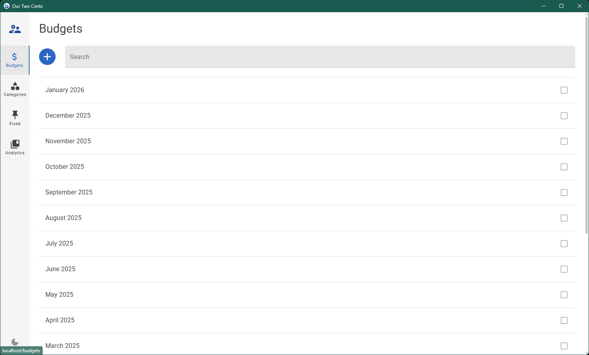
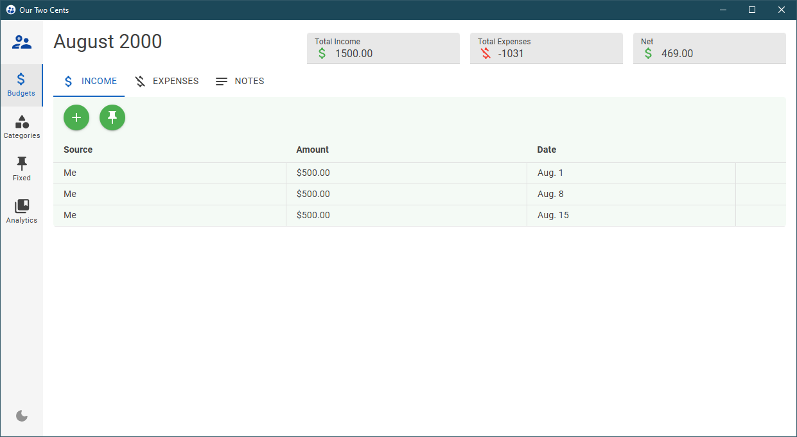
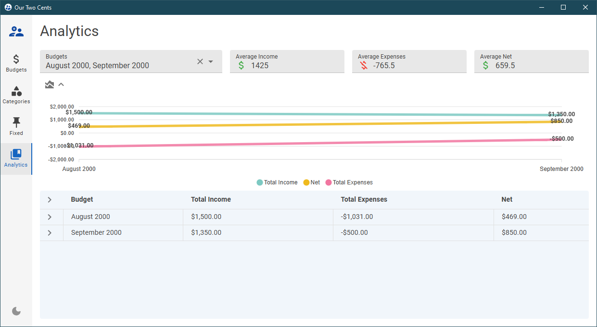

# BudgetApp

**BudgetApp**, or **Our Two Cents**, is a simple budgeting tool with a spreadsheet-like interface for tracking, visualizing, and analyzing monthly income and expenses.

## ✨ Features
- Create and manage monthly budgets with a spreadsheet-style grid.
- Manage expense categories and use them in budgets.
- Manage fixed income or expenses and add them to budgets.
- Visualize data with interactive charts.
- Calculate totals and averages automatically.
- Compare incomes and expenses from each month.
- Pick between light or dark mode. 

## 📸 Screenshots



*Find more screenshots in /assets*

## 🧰 Tech Stack
- Frontend: Blazor, MudBlazor
- Backend: C#, .NET
- Cross-Platform: Photino
- Database: Azure Cosmos DB

## 🚀 Getting Started
1. Create an Azure Cosmos DB resource.
   > Note: The first 1000 RU/s is free, which is more than enough for **BudgetApp**.
2. Create a database and container with partition key "/id" in the Azure Cosmos DB resource.
3. Edit the container's Indexing Policy and add composite indexes for "year" and "month" (to enable ordering by year and month):
   ```json
   "compositeIndexes": [
       [
           {
               "path": "/year"
           },
           {
               "path": "/month"
           }
       ]
   ]
   ```
4. Add the database and container names to [appsettings.json](appsettings.json):
   ```json
   {
       "DatabaseName": "BudgetApp",
       "BudgetsContainerName": "Budgets"
   }
   ```
4. Add the Azure Cosmos DB connection string to [appsettings.json](appsettings.json) (do **not** share the connection string online):
   ```json
   {
      "CosmosConnectionString": "<azure-cosmos-db-connection-string>"
   }
   ```
